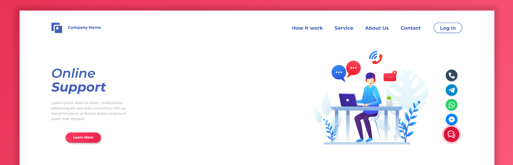
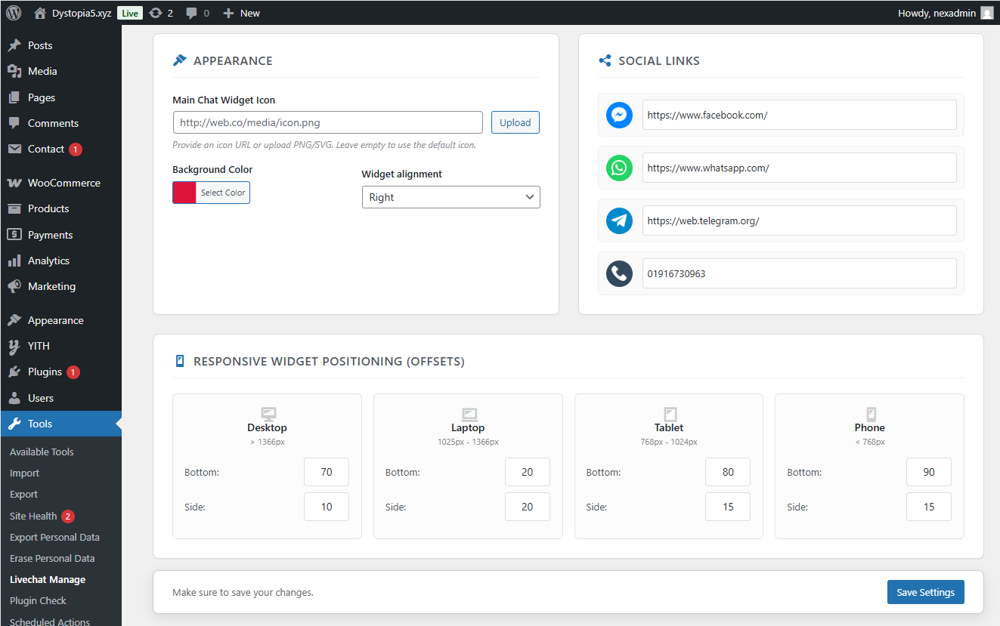
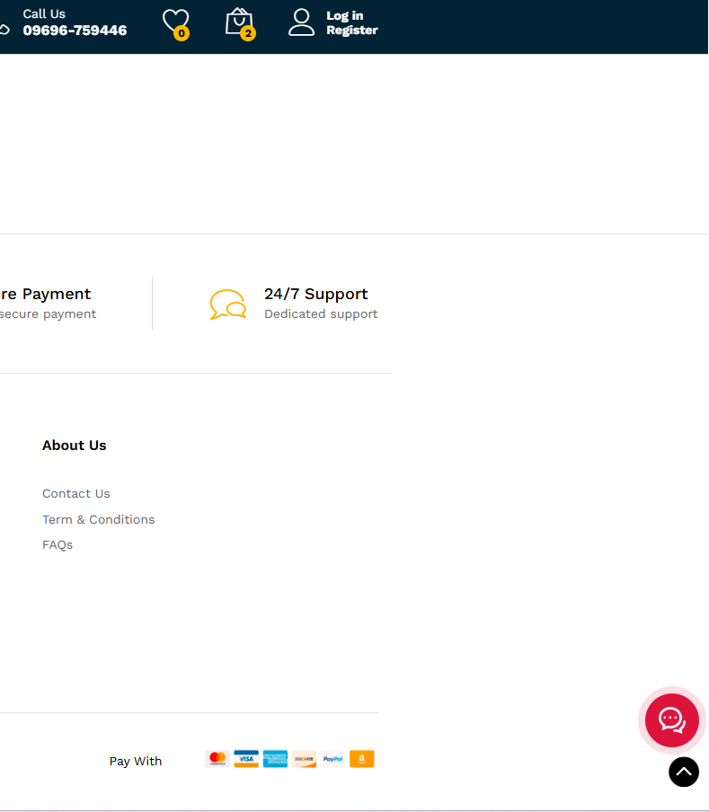
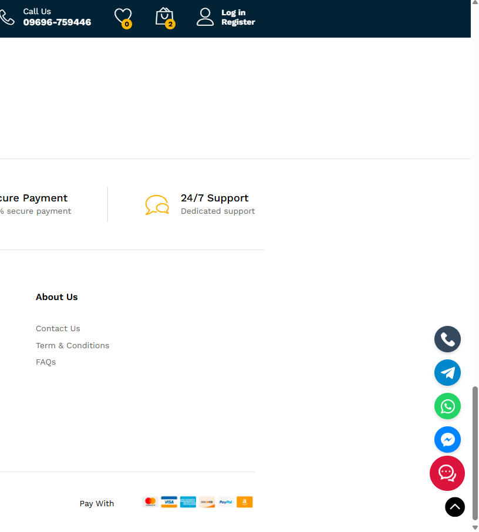
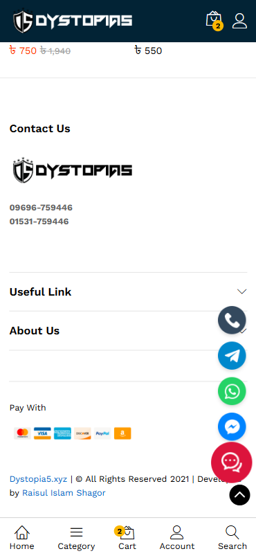

# 💬 Chatikonix Customizable Livechat Widget Icon -  WordPress Plugin

Lightweight, highly customizable floating social media live chat widget with responsive positioning for seamless interaction across all devices.
---

## 📌 Plugin Information
- **Contributors:** shagor447  
- **Tags:** live chat, social media chat, floating chat widget, click to chat, chat
- **Requires at least:** WordPress 6.0  
- **Tested up to:** WordPress 6.9  
- **Requires PHP:** 7.4  
- **Stable tag:** 1.0.3 
- **License:** [GPLv3 or later](https://www.gnu.org/licenses/gpl-3.0.html)

---

## 📖 Description
**Customizable Livechat Widget Icon for Wordpress** is a lightweight and powerful plugin designed to help you connect with your visitors instantly. Instead of complex chat systems, this plugin provides a clean, floating button that expands to show your most important contact channels: **Facebook Messenger, WhatsApp, Telegram, and Phone Call**.

It is designed with performance in mind using pure CSS animations and minimal JavaScript. The plugin offers a modern, side-by-side admin interface where you can customize the appearance, upload your own icons, and control the exact position of the widget for every device type (Desktop, Laptop, Tablet, and Phone).
---

## ✨ Features
- **Multi-Channel Support:** Add links for Messenger, WhatsApp, Telegram, and Direct Phone Calls.
- **Fully Customizable Appearance:** Upload your own custom Main Chat Icon (PNG/SVG) or use the default one.
- **Dynamic Background Color:** Change the widget background color. The pulse animation automatically adapts to your chosen color.
- **Responsive Positioning:** Define specific pixel offsets (Bottom & Side) for **Desktop, Laptop, Tablet, and Mobile** separately. No more overlapping with other elements!
- **Smart Toggle Behavior:** Smooth hover effect for desktops and "Click-to-Toggle" behavior for mobile devices for better user experience.
- **Easy Admin Panel:** User friendly settings page, conveniently accessible from **Tools → Livechat Manage**.
- **Lightweight & Fast:** Zero bloat. Uses optimized assets and clean code to ensure your site speed remains top-notch.

---

## ⚙️ Installation
- Upload the `chatikonix-customizable-livechat-widget-icon` folder to the `/wp-content/plugins/` directory.
- Activate the plugin through the 'Plugins' menu in WordPress.
- Go to **Dashboard → Tools → Livechat Manage**.
- Configure your social links, upload a custom icon (optional), and adjust positioning.
-  Click **Save Settings** and visit your site to see the live chat widget in action.

---

## ❓ Frequently Asked Questions

### 🔹 Where can I find the settings page?
The settings are located under **Tools → Livechat Manage** in your WordPress dashboard.

### 🔹 Can I use my own image as the chat icon?
Yes! In the settings panel, you can upload any PNG, JPG, or SVG image to be used as the main floating button icon.

### 🔹 How do I change the position on mobile devices?
In the settings page, look for the "Responsive Positioning" section. You can set specific "Bottom" and "Side" pixel values for Phone, Tablet, Laptop, and Desktop independently.

### 🔹 Does this plugin store any user data?
No. This plugin simply provides redirect links to your social media profiles. It does not track or store any visitor data.

---

## 🖼️ Screenshots
1. Admin Settings: Appearance and Position configuration. 
2. Frontend view (Desktop): The floating widget in its closed state with the pulse animation. 
3. Frontend view (Desktop): The widget expanded, showing social media icons (Messenger, WhatsApp, Telegram, Phone). 
4. Frontend view (Mobile): The widget expanded, showing social media icons (Messenger, WhatsApp, Telegram, Phone). 

---

## 📝 Changelog

### 1.0.3
- Feature: Complete redesign of the Admin Settings page with a modern side-by-side card layout.
- Security: Implemented strict output escaping (esc_url, esc_attr) and sanitization to meet WordPress standards.
-  Improvement: Moved inline JavaScript to external file and used `wp_enqueue_script` for better performance.
- Fix: Resolved "Text Domain" mismatch and standardized plugin slug.
- Update: Replaced SVG icons with high-quality PNGs for better cross-browser compatibility.

### 1.0.2
- Feature: Complete redesign of the Admin Settings page with a modern side-by-side layout.
- Improvement: Enhanced custom icon handling (uploaded images now display in original colors).
- Fix: Replaced SVGs with high-quality PNG icons for better cross-browser compatibility.
- Fix: Improved hover transition smoothness and default background color logic.

### 1.0.1
- Feature: Added "Responsive Positioning" controls (separate offsets for Desktop, Laptop, Tablet, and Phone).
- Fix: Fixed mobile touch behavior (widget now toggles on click/tap instead of hover).
- Improvement: Added dynamic RGB calculation for the pulse animation color.

### 1.0.0
- Initial release.

---

## 📢 Update Notice
= 1.0.3 = Version 1.0.6 has been released as a stable version.

## ⚖️ License & Copyright
- Copyright © **Raisul Islam Shagor** 
- Email: deploy@raisul.dev
- Website: https://raisul.dev/
- Conatct: https://raisul.dev/contact
- Licensed under the **GPLv3 or later**  
- ✅ This plugin is **free to use, modify, and distribute** under the license terms.
